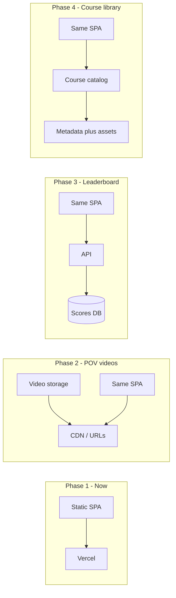

# Deploy Rail Shooter to a Web URL (including portfolio subpath)

Your project is a **Vite 7 SPA** that builds to static files in `dist/` (no server logic). That makes it a good fit for static hosts and easy to plug into a portfolio.

**Grander vision (incremental):** Background environments as **uploaded POV videos** of the rail path; **high-score leaderboard**; **library of popular courses**; and more. The plan keeps the current deploy simple while aligning future phases so today's choices don't block that growth.

---

## 1. Deploy the game to a URL (pick one)

| Approach             | Result                                            | Effort                                           |
| -------------------- | ------------------------------------------------- | ------------------------------------------------ |
| **Vercel**           | `railshooter.vercel.app` or custom domain         | Connect repo, auto-deploy on push                |
| **Netlify**          | `something.netlify.app` or custom domain          | Same idea as Vercel                              |
| **GitHub Pages**     | `username.github.io/repo-name` (or custom domain) | Free; needs `base` in Vite if using project site |
| **Cloudflare Pages** | `project.pages.dev` or custom domain              | Similar to Vercel/Netlify                        |

**Vercel (recommended):**

- Push the repo to GitHub (if not already), then in [Vercel](https://vercel.com): Import project → select repo → leave build command as `npm run build` and output directory as `dist` → Deploy.
- You'll get a URL like `railshooter-xxx.vercel.app`. You can add a custom domain in Project Settings later.

No code changes are required for a **standalone** deploy (game at its own URL).

---

## 2. "Folder redirect" from your portfolio to the game

Yes — you can deploy the game on Vercel and have a path on your portfolio **redirect** to that Vercel URL. The visitor ends up on the game's URL; the "folder" is just the link you use from your site.

- **Portfolio on Vercel:** In the portfolio project, add a redirect in `vercel.json`:
  - From: `yourportfolio.com/games/rail-shooter` (or `/rail-shooter`, etc.)
  - To: `https://railshooter-xxx.vercel.app` (your game's Vercel URL)
- **Portfolio on Netlify:** Same idea with `_redirects` or `netlify.toml` redirects.
- **Portfolio on Apache:** Use `RedirectMatch` or `Redirect` in `.htaccess` for that path.
- **Portfolio on Nginx:** Use `location /games/rail-shooter { return 302 https://...; }`.

So: **deploy game on Vercel → get URL → add one redirect rule on the portfolio host.** That's the "folder redirect" approach.

---

## 3. Same domain, real subpath (no redirect)

If you want the game to **live at** `yourportfolio.com/games/rail-shooter` (same domain, no redirect):

- **Vite:** Add a `vite.config.js` with `base: '/games/rail-shooter/'` so asset paths work under that path. Then `npm run build`.
- **Hosting:** Either:
  - **A) Copy build into portfolio:** After each game build, copy contents of `dist/` into your portfolio repo under e.g. `public/games/rail-shooter/` and deploy the portfolio; or
  - **B) Proxy/rewrite:** Keep the game deployed on Vercel and, on the portfolio (e.g. Vercel rewrites or Nginx proxy), rewrite `yourportfolio.com/games/rail-shooter` to the Vercel app so the browser URL stays on your domain.

Option A is simple if the portfolio is static and you're okay updating it when you release a new game build. Option B avoids copying and keeps one source of truth (Vercel) while still showing the game under your domain.

---

## 4. Future phases: videos, leaderboard, course library

Starting with a **static deploy on Vercel** (or Netlify) is the right first step. As you add the grander features, you can extend the same stack incrementally without re-deploying the front end elsewhere.

- **POV video backgrounds**
  - **Incremental:** Keep the game on Vercel. Store videos in **Vercel Blob**, **Cloudflare R2**, or **S3**; the game loads a course config (e.g. JSON) that points to video URLs. No backend required for a first version if you hand-curate course JSON and upload videos to a bucket.
  - **Later:** If you want user-uploaded courses, add an API (e.g. Vercel Serverless or a small backend) to accept uploads and write metadata; same front end, new routes.
- **High-score leaderboard**
  - **Requires:** An API (submit score, fetch leaderboard) and a database (scores, optional identities).
  - **Fits well:** **Vercel Serverless Functions** plus **Vercel Postgres** or **Vercel KV**; or **Supabase** / **Firebase** so the same domain can host the SPA and call the API. Stay on Vercel for the SPA and add serverless routes in this repo (e.g. `/api/scores`) when you're ready.
- **Library of popular courses**
  - **Incremental:** Start with **static data**: a JSON manifest (or a few JSON files) listing courses (title, video URL, difficulty, etc.) and ship it with the app or from a CDN. No backend.
  - **Later:** Move the catalog to an API and DB (e.g. same Postgres or Supabase), add discovery/ranking and maybe moderation; front end just calls the API instead of loading static JSON.

**Recommendation:** Deploy the current static build to **Vercel** and, if you like, add the portfolio folder redirect. When you add leaderboard or uploads, add Vercel serverless functions (or Supabase) in the same repo and keep one deployment pipeline. For videos and course metadata, introduce a storage bucket and optional DB when you need them; the SPA can stay static and just point at those URLs and APIs.

---

## Summary

- **Easiest:** Deploy this repo to Vercel (or Netlify), get a URL, share that link.
- **"Folder redirect":** Deploy game on Vercel, then add a single redirect on your portfolio so e.g. `yourportfolio.com/games/rail-shooter` sends users to the Vercel game URL.
- **Same-domain subpath:** Add `base: '/games/rail-shooter/'` in Vite, then either copy `dist` into the portfolio or proxy that path to the Vercel deployment.

When your portfolio host is decided (Vercel, Netlify, GitHub Pages, Apache/Nginx, etc.), you can add a concrete redirect or rewrite snippet for that setup.
