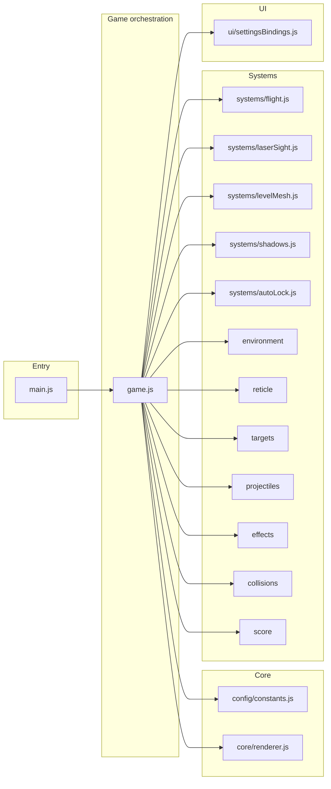

# Game.js Componentization Refactor

## Current state

- **[game.js](src/game.js)** (~1140 lines): Single `initGame()` that does everything—Three.js bootstrap, ~400 lines of settings/UI wiring, constants, flight math (movement, barrel roll, loop), laser sight, level mesh, shadows, auto-lock/auto-fire, and the game loop. Existing systems (environment, reticle, targets, projectiles, effects, collisions, score) are already extracted in [src/systems/](src/systems/).
- **main.js**: Entry point, DOM, settings load/save, calls `initGame()` with a large options object.
- **entities.js**, **input.js**: Clean; no change needed.

## Target architecture

Keep the same runtime behavior and data flow. Split by **single responsibility** so each file has one job and game.js only **composes** and **sequences** systems.

## 1. Config: centralize constants

**New file: [src/config/constants.js](src/config/constants.js)**

- Move all magic numbers from game.js into one place: `bounds`, `groundClearance`, `baseSpeedX/Y`, `forwardSpeed`, `boostMultiplier`, `brakeMultiplier`, `projectileSpeed`, `projectileCooldown`, `barrelRollDuration`, `barrelRollCooldownTime`, `baseRollStrafeMultiplier`, `loopDuration`, `loopCooldownTime`, `loopRadius`, `loopBlendInDuration`, `loopBlendOutDuration`, `shipHitSpheres`, `laserMaxDistance`, `autoLockAcquireDistance`, `playerHitInvuln`, `levelWidth`, etc.
- Export a single object (e.g. `GAME_CONFIG`) or named constants so game and systems can import only what they need.
- Keeps tuning and design numbers understandable and tweakable in one file.

## 2. Core: renderer, scene, camera

**New file: [src/core/renderer.js](src/core/renderer.js)** (or `scene.js` if you prefer one module)

- **createRenderer(container)** → creates WebGLRenderer, sets size/pixel ratio/clear color, appends canvas to container, returns `{ renderer, canvas }`. Keep the same options (antialias, powerPreference, etc.) and error handling (debugEl message on failure).
- **createScene()** → scene + background color.
- **createCamera()** → PerspectiveCamera with current aspect ratio and same near/far.
- Optional: single **createCore(container)** that returns `{ renderer, scene, camera, canvas }` and adds default lights (directional, ambient, hemisphere) to the scene so game.js does not touch THREE lights.

This keeps Three.js bootstrap and resize logic out of game.js and makes reuse (e.g. a second view or post-processing later) straightforward.

## 3. Systems to extract from game.js

### 3.1 Flight (movement + orientation)

**New file: [src/systems/flight.js](src/systems/flight.js)**

- **createFlightSystem({ player, bounds, minY, envState, config })** that owns all flight-related state: `shipVelocity`, barrel roll timers/dir, loop timers/dir, loop vectors (`loopStartPos`, `loopForward`, `loopRight`, etc.), and temporary vectors used only for flight math.
- Export **update(dt, inputState, tuningState)** which:
  - Applies strafe/forward/boost/brake/roll-strafe, clamps position to bounds and minY.
  - Updates barrel roll and loop state machines.
  - Applies orientation (yaw, pitch, roll) including loop-the-loop and barrel roll rotation/position.
- `tuningState` is passed in each frame (speedX, speedY, turnResponse, rollStrafeMultiplier) so sliders in game.js remain the single source of truth. Config (durations, radii) can be read from `config` or from constants.
- game.js will call `updateEnvironment(envState, player.group.position.z)` after flight update (flight does not need to know about environment).

This removes ~200 lines of dense math from game.js and isolates "how the ship moves and rotates."

### 3.2 Laser sight

**New file: [src/systems/laserSight.js](src/systems/laserSight.js)**

- **createLaserSight(scene, options)** with options like `maxDistance`, `lineColor`, etc. (or use config).
- Creates: laser line (BufferGeometry + Line), laser hit sphere, raycaster. Adds them to scene.
- Owns: `laserTarget` (for highlight), `clearLaserHighlight`, `applyLaserHighlight` (target `_laserOriginal` handling).
- Returns:
  - **update(player, targets)** — raycast from nose, update line/hit positions, apply/clear highlight; no return value needed.
  - **setEnabled(bool)** — visibility of line and hit.
- game.js passes `player` and `targets` each frame; no need to pass scene after creation.

### 3.3 Level mesh (debug overlay)

**New file: [src/systems/levelMesh.js](src/systems/levelMesh.js)**

- **createLevelMesh(scene, envState)** builds the existing plane+grid segments per env segment, returns:
  - **setVisible(bool)** — toggles all segment plane/grid visibility.
  - **update(playerPosition)** — wrap segments behind player Z and set segment Y to player Y (current "pass over" behavior).
- game.js calls `setVisible(levelMeshEnabled)` from settings and `update(player.group.position)` each frame.

### 3.4 Shadows

**New file: [src/systems/shadows.js](src/systems/shadows.js)**

- **createShadowsSystem(scene, shadowMaterial)** (or create material inside the module).
- **addPlayerShadow(player)** — creates circle mesh, adds to scene, returns a handle that has `setPosition(x, y, z)`, `setVisible(bool)`.
- **refreshTargetShadows(targets, enabled)** — ensure each target has or hides a shadow (same logic as current `refreshTargetShadows`).
- **updatePositions(playerPosition, targets, floorY)** — set player shadow and each target shadow position (x, floorY, z).
- game.js wires "Shadows: On/Off" to `setVisible` and `refreshTargetShadows`; each frame calls `updatePositions` when shadows enabled.

This keeps shadow creation and layout in one place; targets.js can stay as-is (target shadow creation on spawn can remain in targets.js using a shared shadow material, or move into shadows system—see note below).

**Note:** Today target shadows are created in two places: in `updateTargets` (on spawn) and in `refreshTargetShadows` (when toggling shadows on). Option A: shadows system provides "ensureTargetShadow(t, scene, floorY)" and game calls it from onSpawn and from refresh. Option B: keep spawn logic in targets.js, pass `shadowMaterial` and let targets create the mesh; shadows system only updates positions and visibility. Recommend Option B for minimal change to targets.js.

### 3.5 Auto-lock and auto-fire

**New file: [src/systems/autoLock.js](src/systems/autoLock.js)**

- **createAutoLockSystem({ targetsRef, player, scene, effects, config, scoreSystem })** where `targetsRef` is the same array game.js uses (so auto-lock can splice on hit).
- Owns: `currentAutoLockTarget`, `autoFireLockedTarget`, `autoFirePendingTarget`, `nextShotId`, `nextExpectedHitId` (or these stay in game.js and are passed in—see below).
- **ensureAutoLockState(target)** — idempotent attach of autoLock + indicator (can delegate to targets.attachAutoLockIndicator and a small state object on target).
- **updateEligibility(playerZ)** — set eligible flag on targets within acquire distance.
- **updateTargeting(playerZ)** — pick closest eligible, set targeted, update indicator visibility.
- **resolveAutoLockHit(target)** — add laser beam effect, update combo/shotId, remove target, add explosion, update score.
- **fireAimedProjectile(target)** — create projectile aimed at target, add to scene and projectiles array, assign shotId.
- **getCurrentAutoLockTarget()** / **getAutoFireState()** so game.js can drive "R = auto-lock fire" and "auto-fire when reticle on target."

**ShotId/combo:** Keep `nextShotId` and `nextExpectedHitId` in game.js (or in a small "session" object passed into autoLock and projectiles) so combo rules stay in one place. Auto-lock and projectile hit callbacks can still call `scoreSystem.addHit` / `scoreSystem.resetCombo`; game.js passes those callbacks when creating the auto-lock system so autoLock does not depend on score module directly if you prefer.

Recommendation: game.js keeps `nextShotId`, `nextExpectedHitId`, and the onHit/onMiss combo logic; autoLock receives callbacks `onAutoLockHit(target)` and `onFireAimed(proj)` so game.js assigns shotId and updates expected hit. That preserves current behavior and keeps combo semantics visible in game.js.

## 4. UI: settings bindings

**New file: [src/ui/settingsBindings.js](src/ui/settingsBindings.js)**

- **bindSettingsUI({ elements, resolvedSettings, getTuningState, onSettingsChange, input, ... })** where `elements` is an object with all button and tuning refs (menuButton, toggleMouseButton, toggleTouchButton, etc.).
- Single function that:
  - Sets initial labels and panel state from `resolvedSettings`.
  - Attaches all click handlers for toggles (mouse, touch, menu, instructions, invert Y, hitboxes, shadows, level mesh, laser, auto-lock, auto-fire, debug).
  - Attaches all tuning slider `input` listeners and syncs labels; calls `onSettingsChange` when any setting changes.
- Returns an **emitSettings()** function that game.js can call to persist current state (or pass `onSettingsChange` and have bindings call it internally on every toggle/slider change—current behavior).
- No game logic—only DOM and callback invocation. Game.js still owns `resolvedSettings` and `tuningState`; bindings just read/write them via callbacks if needed (e.g. `getInvertY()`, `setInvertY(bool)` and same for each toggle) or game passes a single "state" object that bindings update and then call `onSettingsChange(state)`.

Prefer: game.js holds the live state (mouseMode, touchMode, hitboxesEnabled, tuningState, etc.); bindSettingsUI receives **refs to that state** or **get/set** functions so that when user clicks "Hitboxes: On", the binding sets the variable and calls `onSettingsChange`. That way game loop and bindings see the same state without duplication.

## 5. game.js after refactor

- **Imports:** config constants, core (createRenderer, createScene, createCamera or createCore), entities, input, all systems (environment, reticle, targets, projectiles, effects, collisions, score, flight, laserSight, levelMesh, shadows, autoLock), ui/settingsBindings.
- **initGame(options):**
  1. Create renderer, scene, camera (or core) and lights; create environment, player; create InputManager and wire canvas/touch.
  2. Build tuning state and resolved settings from options.settings; call **bindSettingsUI(...)** with all toggles/sliders and getters/setters so one place owns UI.
  3. Create flight, laser sight, level mesh, shadows, auto-lock (with callbacks for shotId/combo), and any remaining one-off setup (ship hitbox group, debug overlay).
  4. **Game loop:** input.update() → flight.update() → updateEnvironment → updateTargets → autoLock.updateEligibility/updateTargeting → player hit flicker → updateReticle → laserSight.update (if enabled) → levelMesh.update, shadows.update → fire (manual + auto-fire + auto-lock) → updateProjectiles → projectile/target and target/ship collisions → effects.update → camera + debug + render. Each step is a small number of lines or a single system call.
- **Comments:** Add a short file-level comment (e.g. "Orchestrates game loop and subsystems."). Add section comments in the loop: `// Movement & orientation`, `// World wrap & spawns`, `// Reticle & laser`, `// Fire (manual / auto-fire / auto-lock)`, `// Projectiles & collisions`, `// Camera & render`. Add one or two lines only where non-obvious (e.g. shotId ordering for combo, or dt clamped to avoid spiral on lag spikes).

Result: game.js shrinks to a few hundred lines of wiring and a clear, readable loop. No behavior change.

## 6. Comments policy

- **File-level:** One sentence per module (e.g. "Player movement, barrel roll, and loop-the-loop.").
- **In code:** Only where non-obvious—e.g. "Combo requires hits in shot order; nextExpectedHitId enforces that." or "Blend out duration 0 = snap back to normal roll." No comments for obvious code (e.g. "set visible to true").

## 7. Implementation order (safest)

1. **config/constants.js** — Extract constants; game.js imports and uses them. Verify run unchanged.
2. **core/renderer.js** — Extract renderer/scene/camera/lights; game.js uses createCore(). Verify.
3. **ui/settingsBindings.js** — Extract all toggle and tuning bindings; game.js calls bindSettingsUI() once. Verify all toggles and sliders and persistence.
4. **systems/levelMesh.js** — Extract level mesh create + setVisible + update. Verify.
5. **systems/shadows.js** — Extract player + target shadows. Verify.
6. **systems/laserSight.js** — Extract laser creation and update. Verify.
7. **systems/flight.js** — Extract movement and orientation; game.js calls flight.update() each frame. Verify movement, barrel roll, loop.
8. **systems/autoLock.js** — Extract auto-lock state, eligibility, targeting, resolveAutoLockHit, fireAimedProjectile; wire callbacks from game.js for shotId/combo. Verify auto-lock (R) and auto-fire.
9. **game.js** — Remove duplicated code, keep only orchestration and loop; add section comments and minimal inline comments.
10. **Smoke test** — Full play-through: movement, fire, auto-lock, auto-fire, barrel roll, loop, hitboxes, shadows, laser, level mesh, all toggles and sliders, resize.

---

## 10. Implementation runbook (how to execute the plan)

Work in order. After each step: run the game, do the step's verification checklist, then commit (or at least note "step N done") before starting the next step. If something breaks, fix it or revert that step before continuing.

### Step 1: Config constants

- **Do:** Create `src/config/constants.js`. Copy every numeric/vector constant and the `shipHitSpheres` array from game.js into one exported object (e.g. `GAME_CONFIG`) or named exports. In game.js, add `import { GAME_CONFIG } from './config/constants.js'` (or named imports) and replace each literal with `GAME_CONFIG.xxx` (or the imported name). Remove the now-redundant local constants from game.js.
- **Verify:** Game loads, ship moves and shoots, barrel roll and loop work, projectiles and collisions feel the same. No console errors.
- **Rollback:** Delete `config/constants.js` and restore the original constant declarations in game.js.

### Step 2: Core renderer

- **Do:** Create `src/core/renderer.js`. Implement `createRenderer(container)` (creates WebGLRenderer, sets size/pixel ratio/clear color, appends canvas, returns `{ renderer, canvas }`; same options and debugEl error handling as today). Implement `createScene()` and `createCamera()`. Optionally add `createCore(container)` that creates all three plus default lights and returns `{ renderer, scene, camera, canvas }`. In game.js, replace the inline Three.js setup (renderer, scene, camera, lights) with calls to these functions; keep the rest of init (player, input, etc.) unchanged.
- **Verify:** Scene renders, lighting looks the same, resize still works. Player and targets visible.
- **Rollback:** Revert game.js to inline Three.js setup; delete `core/renderer.js`.

### Step 3: UI settings bindings

- **Do:** Create `src/ui/settingsBindings.js`. Implement `bindSettingsUI({ ... })` that receives all button/slider refs and mutable state (or get/set callbacks) for: menu, mouse, touch, instructions, invertY, hitboxes, shadows, levelMesh, laser, autoLock, autoFire, debug, and all tuning sliders. It should set initial labels from resolved settings, attach every click and `input` listener, and call `onSettingsChange` when anything changes. In game.js, replace the large block of toggle/slider setup with a single call to `bindSettingsUI(...)`, passing the same refs and state that you currently use. Keep game.js owning the state variables; bindings only read/write them and call `onSettingsChange`.
- **Verify:** Open Menu; toggle every button (Mouse, Touch, HUD Tips, Invert Y, Hitboxes, Shadows, Level Mesh, Laser, Instant Laser, Auto Fire, Debug). Move every tuning slider. Reset Settings and reload; all toggles and slider values persist (sessionStorage). Labels update correctly.
- **Rollback:** Revert game.js to inline UI wiring; delete `ui/settingsBindings.js`.

### Step 4: Level mesh

- **Do:** Create `src/systems/levelMesh.js`. Implement `createLevelMesh(scene, envState)` that builds the plane+grid segments (same geometry and materials as in game.js), returns `{ setVisible(bool), update(playerPosition) }`. `update` wraps segment Z when behind player and sets segment Y from player. In game.js, remove the level mesh creation loop and the `setLevelMeshVisible` / segment update code; call `createLevelMesh`, then in the loop call `levelMesh.update(...)` and from the level-mesh toggle call `levelMesh.setVisible(levelMeshEnabled)`.
- **Verify:** Level Mesh toggle shows/hides grid and plane. Segments wrap and track player height as before.
- **Rollback:** Revert game.js and delete `systems/levelMesh.js`.

### Step 5: Shadows

- **Do:** Create `src/systems/shadows.js`. Implement creation of shadow material, `addPlayerShadow(player)` (returns object with `setPosition`, `setVisible`), `refreshTargetShadows(targets, enabled)`, and `updatePositions(playerPosition, targets, floorY)`. In game.js, remove player shadow creation and `refreshTargetShadows`; remove the per-frame shadow position updates. Create the shadows system, add player shadow, and in the loop call `updatePositions` when shadows enabled; wire the Shadows toggle to `setVisible` and `refreshTargetShadows`. Keep target shadow creation on spawn in targets.js (Option B).
- **Verify:** Shadows On/Off toggles player and target shadows. New targets get shadows when Shadows is on. Shadow positions track player and targets correctly.
- **Rollback:** Revert game.js and delete `systems/shadows.js`.

### Step 6: Laser sight

- **Do:** Create `src/systems/laserSight.js`. Implement `createLaserSight(scene, options)` that creates the laser line, hit sphere, and raycaster; owns laserTarget and highlight logic; returns `{ update(player, targets), setEnabled(bool) }`. In game.js, remove laser line/hit/raycaster creation, `clearLaserHighlight`, `applyLaserHighlight`, and the laser block in the loop. Create laser sight, call `setEnabled(laserEnabled)` from the Laser toggle, and in the loop call `laserSight.update(player, targets)` when laser enabled.
- **Verify:** Laser Sight On/Off works. Line and hit marker follow aim; target highlight appears and clears correctly.
- **Rollback:** Revert game.js and delete `systems/laserSight.js`.

### Step 7: Flight

- **Do:** Create `src/systems/flight.js`. Implement `createFlightSystem({ player, bounds, minY, config })` that owns all movement/orientation state (velocity, barrel roll, loop timers and vectors). Export `update(dt, inputState, tuningState)` that does position update, clamping, barrel roll and loop state machines, and rotation (yaw, pitch, roll). In game.js, remove the movement/orientation block and all flight state variables; create the flight system and in the loop call `flight.update(dt, state, tuningState)` immediately after `input.update()`. Still call `updateEnvironment(envState, player.group.position.z)` from game.js after flight.
- **Verify:** WASD/arrows movement, boost/brake, barrel roll (Shift+left/right), loop (Shift+up). Ship stays in bounds and above floor. Orientation matches input; no jitter or wrong rotation.
- **Rollback:** Revert game.js and delete `systems/flight.js`.

### Step 8: Auto-lock

- **Do:** Create `src/systems/autoLock.js`. Implement `createAutoLockSystem({ targetsRef, player, scene, effects, ... })` with `ensureAutoLockState`, `updateEligibility`, `updateTargeting`, `resolveAutoLockHit`, `fireAimedProjectile`. Game.js keeps `nextShotId`, `nextExpectedHitId`, and passes callbacks so autoLock calls back for shotId assignment and combo (addHit/resetCombo). Expose `getCurrentAutoLockTarget()` and auto-fire state (e.g. reticle target → autoFirePendingTarget) so the loop can invoke auto-lock fire (R) and auto-fire when reticle on target. In game.js, remove the inline auto-lock/auto-fire logic and replace with calls to the new system.
- **Verify:** R (auto-lock) locks and fires at closest eligible target; combo and score update. Auto Fire on + reticle on target fires aimed projectiles; combo works. Indicators and targeting behavior unchanged.
- **Rollback:** Revert game.js and delete `systems/autoLock.js`.

### Step 9: Slim down game.js and add comments

- **Do:** Remove any remaining dead code. Ensure the loop is only orchestration (short blocks or single system calls). Add a file-level comment. Add section comments in the loop (`// Movement & orientation`, `// World wrap & spawns`, etc.). Add 1–2 inline comments only for non-obvious behavior (e.g. combo shot order, dt clamp).
- **Verify:** Same as Step 10; game still runs identically.

### Step 10: Smoke test

- **Do:** Full manual pass: movement (WASD, boost/brake), fire (space), auto-lock (R), auto-fire (toggle + reticle), barrel roll, loop, hitboxes toggle, shadows toggle, laser toggle, level mesh toggle, all tuning sliders, Menu open/close, Reset Settings, window resize. Confirm no regressions.
- **Done:** All 10 steps complete; game.js is componentized and behavior is preserved.

## 8. What stays in game.js (summary)

- Composing and creating all subsystems.
- The game loop and its **order** of updates.
- Ownership of `projectiles`, `targets`, `targetSpawnTimer`, `playerHitTimer`, `nextShotId`, `nextExpectedHitId` (and passing them into systems that need them).
- Ship hitbox group creation and visibility (could move to a tiny `systems/playerVisuals.js` later if desired).
- Calling `handleProjectileTargetCollisions` and `handleTargetShipCollisions` with the right callbacks (score, combo).
- Camera positioning and debug overlay text.
- `requestAnimationFrame` and resize listener.

## 9. Risk mitigation

- **No refactor of existing systems** — environment, reticle, targets, projectiles, effects, collisions, score stay as-is; only game.js and new modules change.
- **One logical change per step** — each new file is added and wired, then verified, so regressions are easy to attribute.
- **Same public API** — `initGame(options)` signature and behavior unchanged so main.js does not need to change (only import path if you move something).

This gives you a componentized, understandable codebase that preserves functionality and sets you up for higher goals (new weapons, levels, or modes) without touching a giant monolith.

---

## Follow-up (done)

- **Renamed "Auto Lock" → "Instant Laser"** — UI button and instructions now say "Instant Laser: On/Off" and "Instant Laser: R"; tooltip describes hold R to lock and fire. Settings key renamed to `instantLaserEnabled` everywhere (defaults, state, emitSettings, sessionStorage); loadSettings migrates old `autoLockEnabled` from sessionStorage so existing preferences are preserved.
